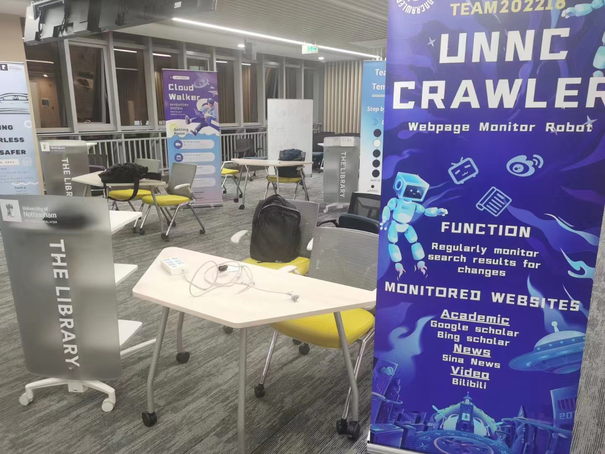

# Reports

## Interim Group Report

The interim report shows our work content and project expectations for half a semester.

## Final Group Report

The final report shows our final product effect and use method. In terms of product results and scores obtained, this project was a success and an excellent junior year assignment.

## Indiviual Report

The personal report part shows my contribution in the project and the content of peer evaluation and grading. Because the Peer Assessment part of the Individual Report may involve the privacy of classmates, it is removed from the report.

## Open Day(Product Promotion Meeting)

<table>
  <tr>
    <td>
      
    </td>
    <td>
      
    </td>
  </tr>
  <tr>
    <td>
      
    </td>
    <td>
      
    </td>
  </tr>
</table>